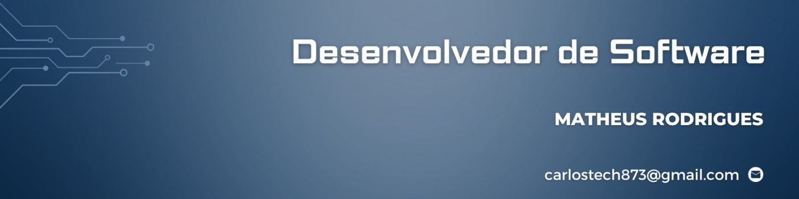

   
    
   

## Hi, my name is Matheus 👋

### About me:
  <ul>
    <li>💻 I'm 23 years old, a fullstack developer with 2 years of experience working as a freelancer</li>
    <li>📒 Studying - Higher Education in Information Systems - Federal Institute of Alagoas</li>
    <li>🚀 I am organized, I have good interpersonal relationships, good critical analysis skills and always willing to learn and teach.</li>
    <li>❤️‍🔥 Passionate about technology</li>
  </ul>

### Linguages and tools:

  
  
  
  
  
  
  
  
  
  
  

<h5>🚀 lets rock the future</h5>
